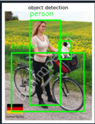
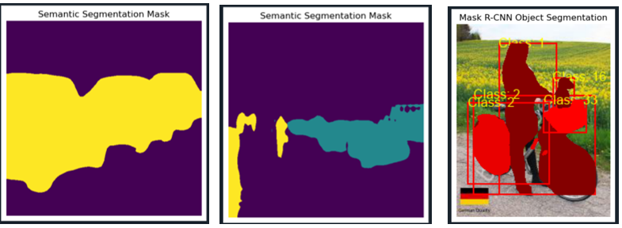
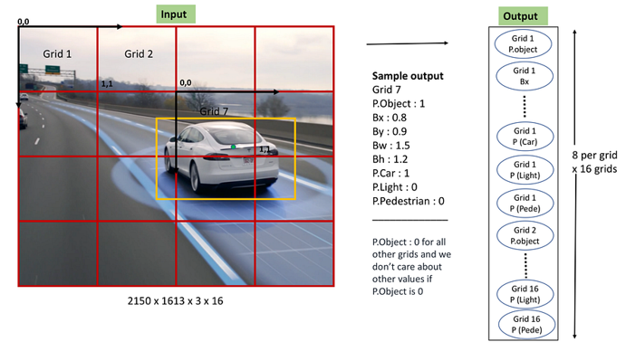
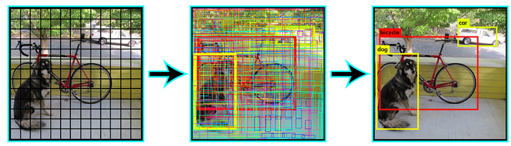
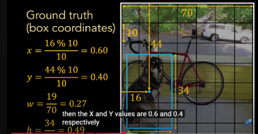
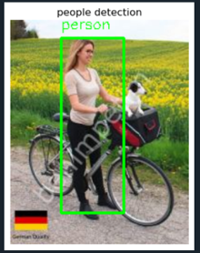

# CVStaj
# 🧠 Görüntü İşleme ve YOLO Algoritması

## 📌 Sınıflandırma (Classification)
- Görüntülere veya bölgelere etiketler atar.
- Görüntü içeriğinin kapsamlı bir şekilde anlaşılmasını sağlar.
- Görüntü etiketleme ve etiketlemeyi etkinleştirir.

---

## 📌 Nesne Tespiti (Object Detection)
- Belirli nesneleri ve konumlarını tanımlar.
- Hassas nesne yerelleştirmesi için sınırlayıcı kutular (bounding box) kullanılır.
- Video gözetimi ve güvenlik izlemeyi etkinleştirir.
- Tarımda ürün izleme ve zararlı tespiti için kullanılır.

---

## 📌 Segmentasyon (Segmentation)
- Nesne sınırları ve bölgeleri hakkında ayrıntılı bilgi sağlar.

---

## ⚙️ YOLO (You Only Look Once) Algoritması

YOLO algoritması, görüntüyü `S x S` boyutlarında ızgaralara böler. Her ızgara hücresi:
- Nesne olup olmadığını tespit eder.
- Orta noktası içindeyse `x`, `y`, `w`, `h` koordinatlarını tahmin eder.
- Sınıf olasılıklarını üretir.

### 🔢 Tahmin Vektörü İçeriği:
- **Güven skoru (Confidence Score):** Nesne varlığına olan güven.
- **Bx:** Nesne orta noktasının X koordinatı.
- **By:** Nesne orta noktasının Y koordinatı.
- **Bw:** Nesne genişliği.
- **Bh:** Nesne yüksekliği.
- **Bağlı sınıf olasılıkları:** Her sınıf için bir olasılık değeri.

🔹 **Güven skoru** = `Kutu Güven Skoru` × `Bağlı Sınıf Olasılığı`  
🔹 `Kutu Güven Skoru` = `P(nesne)` × `IoU`  
🔹 `P(nesne)` = Nesne içerip içermediği olasılığı  
🔹 `IoU` = Tahmin kutusu ile gerçek kutu arasındaki örtüşme oranı

---

## 🛠️ YOLO Algoritmasının Adımları
1. Girdi görüntüsü `S x S` grid hücrelerine ayrılır.
2. Her hücre:
   - 1 veya daha fazla bounding box üretir.
   - Confidence score verir.
   - Sınıf olasılıkları çıkarır.
3. CNN tabanlı mimari ile çalışır.

---

## 📦 Anchor Box Nedir?

YOLO'da farklı boyutlardaki nesneleri tespit etmek için kullanılan sabit kutu şablonlarıdır.

- Her hücreye birden fazla anchor box atanır (örneğin 3 tane).
- Her anchor box:
  - Nesne skoru (objectness)
  - Sınıf olasılığı
  - Konum düzeltmesi tahmin eder (`x`, `y`, `w`, `h`)
- Eğitimde, nesneye en uygun anchor box seçilir (IoU değeri en yüksek olan).

---

## 📏 Kutu Koordinatları ve Tespit Süreci

- Bounding box koordinatları kutu merkezine göre hesaplanır.
- Sadece merkezi bir grid hücresine düşen kutular dikkate alınır.
- Tespit sonrası IoU hesaplanarak güvenilirlik eşik değeriyle karşılaştırılır.
- En iyi kutular seçilerek sonuçlar elde edilir.

---

## 🔄 YOLO Sürümleri Arasındaki Farklar

| Versiyon  | Özellikler |
|-----------|------------|
| YOLOv1    | Her grid hücresi yalnızca tek nesne tahmin edebilir. Çok nesneli sahnelerde düşük performans. |
| YOLOv3+   | Multi-label destekler. Nesne birden fazla sınıfa ait olabilir (örneğin hem "animal" hem "dog"). Anchor-based mimari. |
| YOLOv8    | Anchor-free mimari. Tespit için IoU + NMS + confidence threshold kullanılır. |

---

## 🚶‍♂️ YOLO ile İnsan Tespiti

YOLO, insan tespiti gibi gerçek zamanlı uygulamalarda sıkça kullanılır.

---
